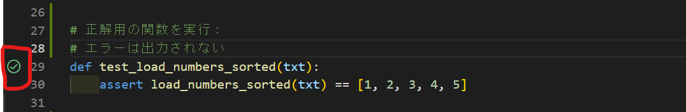

# "pytest"を使用したユニットテストの概要


# pytestとは？

Pythonを利用した開発において、各クラスや関数の挙動が想定した設計通りになっているかを検証する作業は重要である。しかし、実装内容が複雑になるほど、すべての内容についてコードレビューのみで概要の把握は難しい。こういった問題を解決する上で、重要な開発においてはユニットテストを行うことがある。本資料では"pytest"と呼ばれるライブラリを使用してユニットテストを実行する方法について解説し、手軽に開発現場に導入するまでの簡単な概要をまとめたものである。


# 資料を読むうえでベースとなる知識

* pythonについて
  * classや関数について  
    この資料では基本的なpythonでのクラスや関数のクラスについての基本的な書き方を理解している読者を対象にしている。特に、pytestでは返り値を返す"return"の代わりに"yeild"を使用するなど、普段初心者が扱わないような書き方をする場合もあるので、別途資料を参照するとよい。

* フィクスチャの概念  
  * pytestで、普段の開発では登場しない。"フィクスチャ"の概念を導入する。具体的な内容については後述するが、  


> この報告書の概要は以下の通り。

* インストールについての手順
* pytestの主な機能とオプションについて
* VScode上での開発で使用できる簡単な拡張機能


# "pytest"のインストール手順について


pip を利用してインストールする場合：
ターミナルで以下を実行する
```
pip install pytest
```

condaを利用したインストール手順：
ターミナルで以下を実行する

```
conda install -c anaconda pytest
```


# pytestの基本的な使い方

開発段階でpythonのクラスや関数を実装した状況でユニットテストを実行することを想定する。

* 確認したい関数やクラスについて、想定される入力内容と出力内容を確認する。

* テストを実行する用のスクリプト別途作成し、以下を実行する。
  * ファイル名を"test_*"にする。（これは所属先でルールを定める）
  * テストしたい関数、クラスを"import"文で取り込み、"assert"文を利用してテストしたい内容を書き込む。
  * "pytest"コマンドを利用して、テストを実行する。

### 実行例

素数判定する関数を作成したとする(ファイル名を"prime.py"、関数名を"is_prime"とする。)この関数についてテストを行うために、以下のようなスクリプトファイルを用意する。

### test_prime.py
```
# 作成した関数のimport
from prime import is_prime

# テスト内容
def test_is_prime():
    assert not is_prime(1)
    assert is_prime(2)
    assert is_prime(3)
    assert not is_prime(4)
    assert is_prime(5)
    assert not is_prime(6)
    assert is_prime(7)
    assert not is_prime(8)
    assert not is_prime(9)
    assert not is_prime(10)
```


# pytestの機能

以下では、テスト作業の高度化で利用できる"pytest"の機能について調査した結果をまとめる。

* 具体的な紹介機能
  * 入力内容をパラメータ化してテストを実行する  
    * 複数のテスト内容を一度の実行で完結させる機能
  * フィクスチャ
    * テストの実行前後で行いたい前処理・後処理を記述する


## 1. パラメータ化したテスト
> * 特徴
>   * テスト実行時に入力する内容をパラメータ化し、それらすべての入力についてテストすることができる。
>   * テストのための入力パラメータは"pytest"に付属されたデコレーターを使用して入力する。（サンプルを紹介する。）
> 
> 単純に"assert"文を利用してテスト内容を記述すると、一部のテストのみが実行されて終了する。素数判定の関数の例では is_prime(4)のテストに失敗すると、その時点でテストが終わってしまうため、is_prime(5) 以降のテストが実行されない。
> 
> ### "pytest"のデコレーターを利用した実装の例
> ```
> import pytest
> from prime import is_prime
> 
> @pytest.mark.parametrize(('number', 'expected'), [
>    (1, False),
>    (2, True),
>    ～略～
>    (10, False),
> ])
>
> def test_is_prime(number, expected):
>    assert is_prime(number) == expected
> ```


## 2. フィクスチャ
>* 特徴
>   * テストの実行前後で行いたい前処理・後処理を暗黙的に記述する.
>   * ファイルの読み込みを伴うようなユニットテストについて実行する際に便利
>   * 複数テストがあってテストごとにオブジェクトを作るのではなく、最初に一度だけ作ってテスト間で使い回したい場合
>   * 全部のテストが終わったら後始末したい
> 
> 特定の前処理や後処理について別途関数を用意して、その部分についてはテスト作業に含めずに別途作動させるようにすることができる。ファイルの読み込みを前提としたユニットテストなどに便利。
> * 基本的な書き方
> 
> 関数の基本的な書き方は以下の通り。
>
> ```
> @pytest.fixture
> def [関数名]():
>    # 前処理
>
>    yield ...   # テスト関数に何らかの値を渡す
>
>    # 後処理
> ```
>
> 前処理と後処理について同じ関数内に定義し、テスト関数に引き渡す引数を"yeild"を使って指定する。
>
> ### 具体例：
> ファイルから整数を受け取り、それを昇順に読み込む関数についてユニットテストを実行することを考えたいとする。前提として数値が記述されているファイルのパスを入力とする。
>
> * テストしたい関数
> ```
> from typing import List
> 
> # List[int] で要素が int のリスト型を表す型ヒントになる
> def load_numbers_sorted(txt: str) -> List[int]:
>    numbers = []
>
>    with open(txt) as f:
>        numbers = sorted(map(lambda e: int(e), f))
>
>    return numbers
>```
> 
> * テスト用のスクリプト
> 
> ```
> import pytest
> 
> # テスト用のファイルを事前に生成、テキストファイルとして出力する関数を用意する
> @pytest.fixture
> def txt() -> str:
>     with open('numbers.txt', 'w') as f:
>        for n in [2, 5, 4, 3, 1]:
>            f.write('{}\n'.format(n))
>    yield 'numbers.txt'
> 
> def test_load_numbers_sorted(txt):
>     assert load_numbers_sorted(txt) == [1, 2, 3, 4, 5]
> ```
>
> * 上記のサンプルの実行手順
>   1. テスト関数にフィクスチャのtxt()を渡す。
>   2. numbers.txt が作成される
>   3. test_load_numbers_sorted('numbers.txt') が呼ばれる


## 追加機能
> ### フィクスチャの連携
> 
>> 以下のように別のフィクスチャを作成した際に別のフィクスチャそのものを呼び出すこともできる。
>>
>> ```
>> @pytest.fixture
>> def txt_and_list(txt) -> Tuple[str, List[int]]:
>>    yield txt, [1, 2, 3, 4, 5]
>> 
>> def test_load_numbers_sorted(txt_and_list):
>>    assert load_numbers_sorted(txt_and_list[0]) == txt_and_list[1]
>> ```


> ### テンポラリの作成
>> pytest には安全にテンポラリを作成するための tmpdir というフィクスチャがあらかじめ用意されている。tmpdir を使うと /tmp 配下にファイルを作成するため、ファイル管理がスマートになる。
>> 
>> * tmpdir の使い方
>> ```
>> @pytest.fixture
>> def txt(tmpdir) -> str:
>>     tmpfile = tmpdir.join('numbers.txt')
>>
>>    with tmpfile.open('w') as f:
>>        for n in [2, 5, 4, 3, 1]:
>>            f.write('{}\n'.format(n))
>> 
>>    yield str(tmpfile)
>>    tmpfile.remove()
>> ```

> ### フィクスチャのスコープ
>> フィクスチャを呼び出す場合、デフォルトでは実行する関数ごとにフィクスチャを呼び出している。このスコープ（現数が定義される領域）を変更することで、クラス、モジュール単位に変更することができる。
>> 
>> * スコープ変更方法
>> 
>> ```
>> # スコープをモジュール単位に変更する場合
>> @pytest.fixture(scope='module')
>> def txt(tmpdir) -> str:
>>  ...
>> ```
>> 
>> 
>> * 設定できるスコープ
>> 
>> | scope | 説明 |
>> | --- | --- |
>> | function   | テスト関数ごとにフィクスチャを実行（デフォルト） |
>> |  module   |  同一モジュール（ソースコード）内で1回だけフィクスチャを実行   |
>> |  class   |  同一クラス内で1回だけフィクスチャを実行   |
>> |  session   |  テスト実行時に1回だけフィクスチャを実行   |
>>
>
>> * 具体例:
>>  例として、フィクスチャを"txt()"で用意し、以下のテスト関数を呼び出す状況を考える。
>> 
>> ```
>> def test_sample1(txt):
>> ...
>> def test_sample2(txt):
>> ```
>>
>> この場合フィクスチャであるtxt() は各テスト関数を実行するたびに毎回呼び出される。場合によってはこれが非効率で冗長になることもある。


> ### 複数のファイルをまたいで共通のフィクスチャを使用するとき
> 
>> フィクスチャを conftest.py というファイルに定義する。conftest.py 内のフィクスチャは pytest によって自動的にインポートされ、conftest.py があるディレクトリ配下で暗黙的に参照できるようになる。
>> ```
>> .
>> └─tests
>>    ├─conftest.py .............. 全テストで参照可能
>>    ├─test_sample1
>>    │  ├─conftest.py .......... test_sample2.py, test_sample3.py で参照可能
>>    │  ├─test_sample2.py
>>    │  └─test_sample3.py
>>    └─test_sample4
>>        ├─conftest.py .......... test_sample5.py, test_sample6.py で参照可能
>>        ├─test_sample5.py
>>        └─test_sample6.py
>> ```
>
> ### 標準出力のキャプチャ
>> 標準出力にメッセージを出力する関数をテストしたい時には標準出力をキャプチャして出力されたメッセージを確認することができます。
>>
>> * 具体例
>>
>> ```
>> def fibonacci(n: int):
>>    a = 0
>>    b = 1
>>    for _ in range(n):
>>        print(b)
>>        a, b = b, a + b
>> ```
>> と出力されます。本当にこのように出力されるかどうかをテストしたい時には次のように書きます。
>> 
>> ```
>> def (capsys):
>>    fibonacci(5)
>>    out, _ = capsys.readouterr()
>>    assert out == (
>>        '1\n'
>>        ~ 略 ~
>>        '5\n'
>>    )
>> ```
>> 
>> capsysは標準出力と標準エラー出力をキャプチャするためのフィクスチャです。
>> ```
>> capsys.readouterr()
>> ```
>>
>> はキャプチャした標準出力と標準エラー出力の文字列をタプルとして返す。
> 
> 


> ## テストのグループ分け
> 
> * 使い道
>   * 小さいテストデータと大きいテストデータがあって、小さいテストデータだけ試したい処理の種類がいくつかあって、特定の種類の処理に関するテストだけ実行したい場合
> 
> * 書き方
> テストごとに @pytest.mark.xxxx というデコレータを付けます。このxxxxに具体的な名前を付けます。
> 
> 
> * 具体例  
>   今回は、軽めのテストに「small」、重めのテストに「large」という名前を付ける。
> 
>
> ```
> #!/usr/bin/python
> # -*- coding: utf-8 -*-
> 
> import pytest
> import time
> 
> @pytest.mark.small
> def test_1():
>    time.sleep(0.1)
>    assert "aaa" == "bbb"
> 
> @pytest.mark.small
> def test_2():
>    time.sleep(0.1)
>    assert "bbb" == "bbb"
> 
> @pytest.mark.large
> def test_3():
>    time.sleep(10)
>    assert "aaa" == "bbb"
> ```
> 
> * 軽めのテストだけ実行する場合
> ```
> $ pytest -m small test_app5.py
> ```
> -mを付けないと、今まで通り全部のテストが実行される。

> ## pytest-mockを使用したモックテスト
> * モック(アップ)とは
>   * 開発現場における、一時的な完成イメージの作成を行うこと(?)である。pytestでは、モックを利用することでテスト動作中に一時的に処理を差し替えて動作してくれる。モック化した箇所は対象のテスト中においてのみモックとして扱われ、それ以外のテストでは通常の実装内容に戻ってくれる。モックをうまく使えば機能単位でいい感じにテストすることができる。
> 
> ### RPAのテスト作業における具体的な使用方法について
> * 具体例：
>   * 本環境でGUIを起動させ、そのGUI上で入力を打ち込むことを想定する場合、テスト作動注意に一々GUIを起動させるのは面倒。そこで、”GUIの起動 ~ GUIへの入力”をモックし、"仮にGUIから以下のような ~ のような入力があった場合"についてのみテストすることができる。
> 
> ### pytestでのモック用ライブラリのインストール方法
> 以下のコマンドを実行することで、pytestにmockerのフィクスチャが導入される。(conda でもインストール可能)
> 
> ```
> pip install pytest-mock
> ```
> 

# Vscode 上での運用方法について

> ## step1. vscode上でのpytestの設定方法

vscodeが標準で使用しているユニットテストの方法について設定変更して上げる必要がある。

1. インタプリタの設定

[Ctrl + Alt + P]でインタプリタの指定を以下のように行う。


2. ユニットテストの方法を指定する


"pytest"を押すと、自動でpytestがインストールされる。


以下のサンプルのディレクトリ構造を考える。
```
(root)
└─pyproject
    └─__init__.py
    └─example.py
    
└─tests
    └─__init__.py
    └─test_hello.py
```


3. ディレクトリを指定すると


* .pytest_cache
* .vscode

のフォルダが作成される。

具体例


> ## step2. テストの実行

設定が完了すると、以下の様なフラスコの形のアイコンが左側に出現する。


左側のチェックマーク(もしくはバツマークの)のアイコンを押しても実行できる


## 具体的な使用方法について


# pytest利用人オプションについて

pytest コマンドに便利なオプションを追加する
オプションがいくつもあり、以下のオプションをつけておくと便利。

```
--pdb: テスト失敗時に pdb（デバッガ） を起動
--ff: 前回失敗したテストを先に実行
```

オプションは環境変数 PYTEST_ADDOPTS に定義すると、コマンド実行時に省略できる。

```
export PYTEST_ADDOPTS='-v -s --pdb --ff --doctest-modules' # おすすめ！
pytest # PYTEST_ADDOPTS が自動で付加されて実行
```

# 参考

* python開発における基本的な知識
https://rinatz.github.io/python-book/ch08-02-pytest/

* pytestの基本的な機能についての紹介

https://qiita.com/everylittle/items/1a2748e443d8282c94b2


* vscode上でのpytestについて

https://gri.jp/media/entry/358


* vscode状のデバッグについて

https://www.bravesoft.co.jp/blog/archives/14082


* pytest-mockについて(pytest状のモックについて)

https://webbibouroku.com/Blog/Article/pytest-mock#outline__1


* pytestの基本的な使い方

https://www.m3tech.blog/entry/pytest-summary