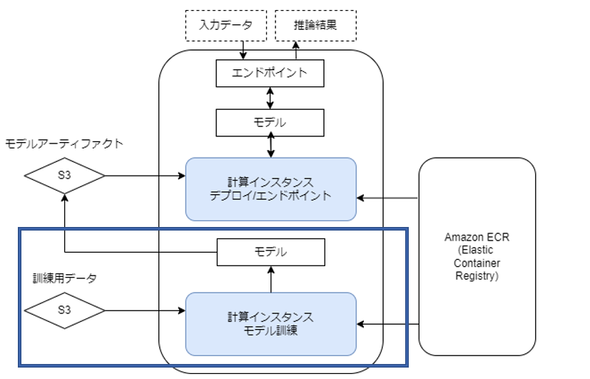

# Sagemakerの特徴：
1. インターフェース
   SageMakerでは、Jupyter Notebookを使用して、「インスタンスの作成」、「モデル構築」、「トレーニング」、「デプロイ」までのフローを実行することができる。対話型のブラウザで実行することで、実行結果を分かりやすい形で監視することができる。

2. 主要な機械学習フレームワーク
   Tesnsorflowやsklearnなどの機械学習モデルをDockerコンテナ上で実行するように構成されている。
3. 一般的な機械学習アルゴリズムが事前にインストールされている。
   (他の機械学習サービスと比較して、高いパフォーマンスでアルゴリズムを実行できる可能性が高い)
4. ワンクリックトレーニング
   SageMakerのコンソールからワンクリックで高度なトレーニング他チューニングを実行できるようになっている。
5. フルマネージメントスケーリング機能
   インフラ部分については自動的に管理されてスケーリング(規模の増減、面積の拡大縮小）されるので、ペタバイト規模のモデルトレーニングが簡単にスケーリングできる。

# 基本的な準備:

1. S3バケットの作成
   名前の中で「sagemaker」の文字列を含める必要がある。

2. Amazon SageMakerのトップページから、ノートブックを作成する。
   ノートブック作成の際にインスタンスを指定する。
   
3. IAMロールの作成

# SageMakerのセットアップ

まずはコンソールログインする。

ノートブックインスタンスを選択

# AWSサービスの概要

## データ分析とデータ習得

AWSでデータ管理に使うことのできるサービス：

* Amazon SageMaker Ground Truth  
  * データのラベル付けを簡単に行うことができるデータラベリングサービス
  * Amazon SageMaker Ground Truth では手動ラベリングと自動ラベリングを選択することができる。
    * 手動ラベリング：  
      3 種類のチームを選択することができる。
      
      1. 社員などのプライベートのチーム
      2. Amazon Machanical Turk を使用したパブリックチーム
      3. ベンダーなどのサードパーティーのチーム  
      
      チームのメンバーは Amazon SageMaker Ground Truth が用意した UI を通してラベリング作業を行う。

   * 自動ラベリング：  
      手動ラベリングに追加して有効化でき、ビルトインアルゴリズムを利用した機械学習のモデル学習を行う。  

   * ラベリングされたデータは安価で高耐久なオブジェクトストレージである Amazon S3 のバケットに格納されます。

* Amazon Athena
  * インタラクティブなクエリサービス. Amazon S3 内のデータを標準 SQL を使用してクエリを取得できる。
  * サーバーレスでインフラストラクチャの管理かつ実行したクエリに対してのみ料金が発生。

* Amazon Redshift
  * データウェアハウスサービスです。データウェアハウス（DWH）というのは、さまざまなデータ源からデータを収集・統合・蓄積し、分析のため保管しておくシステムのこと。伝統的なRDBMSとは違って、継続的な書き込みや更新には向いておらず、一括でデータを書き込み分析のため大容量データを読み出すという処理に最適化されている。その結果として、たとえばRDB設計における正規化はデータウェアハウスでは重視されず、読み出しの高速化のためにあえて正規化しないでデータを格納することもある。Amazon Redshiftでは、並列コンピューティングをサポートしており、大量のデータを短時間で読み出し・分析することが可能です。インターフェイスとしては、BIツールやPostgreSQLクライアントから操作することが可能。

_____
## 前処理

* Amazon SageMaker Processing
   Amazon SageMaker SDK を通して、コンテナイメージ、前処理のコード、入力と出力の Amazon S3 バケットを指定することで、自動でインフラの構築と処理を実行する。Amazon EC2 インスタンスの起動や停止、ライブラリのインストールなどを考える必要がない。

* AWS Batch
   Amazon SageMakerで一気通貫に行う必要がない場合に利用できる。

* AWS Glue
   より複雑なデータの変換などをしたい場合、Apache Sparkで大規模に処理したい場合などに利用すると良い。

_____
## モデルの構築・学習

* SageMaker
  * Sagemakerでは組み込みのアルゴリズムに加えて以下のようなフレームワークを利用できるコンテナを提供している。
    * TensorFlow
    * Pytorch
    * Apache MXNet
    * XGBoost
    * scikit-learn

# 機械学習モデルの作成

## Sagemakerによる機械学習モデルの作成

### 学習時と推論時の環境の一致について  

Sagemakerでは、基本的に学習用と推論用のコンテナを分けて運用することが前提となっており、それぞれについてコンテナイメージを用意する必要がある。また、SageMakerでは組み込みのコンテナを用いてモデルを学習させる、もしくは独自のモデルを含むコンテナを用意する必要があり、その際には学習用と推論用のコンテナイメージに含まれる環境をできる限り統一する必要がある。

### 推論器の稼働

SageMakerを利用することで、推論用の環境を独自で用意する必要はなくなる。基本的はモデルのデプロイ時に推論用のエンドポイントを作成して、そのエンドポイントを通じて推論用のサーバーに入力値を送信する。

* 大量のモデルを管理したい場合
SageMakerでは複数のモデルについていつでも本番環境で利用できるようにマルチモデルエンドポイントを利用することができる。また必要に応じて、1 つのエンドポイントに複数のトレーニング済みモデルをデプロイし、単一のサービングコンテナを使用して稼働させることでコストの削減を行うことができる。エンドポイントを呼び出す際には、ターゲットのモデル名を指定することで、特定のモデルに簡単にアクセスできる。

* 新しくモデルを追加する場合  
  S3 ではモデルのどの階層でもエンドポイントを定義でき、マルチモデルエンドポイントにモデルを追加するには、新しいトレーニング済モデルのアーティファクトを S3 に追加して呼び出せば良い。

* すでに使用中のモデルを更新する場合  
  S3 に新しい名前のモデルを追加して、新しいモデル名でエンドポイントの呼び出しを開始する。マルチモデルエンドポイントでデプロイされたモデルの使用を中止するには、モデルの呼び出しを停止し、S3 からモデルを削除すればよい。

* 具体的なユースケース
  * 法律関係のアプリケーション  
      広範な規定上の管轄を完全にカバーする必要がありますが、それにはめったに使用されないモデルが多数含まれることになります。1 つのマルチモデルエンドポイントでは、使用頻度の低いモデルに対応し、コストの最適化と大量のモデルの管理を効率よく行うことができます。

また、SageMakerでは訓練用データ、出力先ファイルの他にモデルの学習に必要な環境変数（インスタンスの数など）を引き渡すことで、以下の訓練ジョブのフローを容易に行うことができる。

  * 訓練ジョブの実行フロー
    1. S3からの入力データの読み込み
    2. データを利用したモデルの訓練
    3. モデルをS3に書き戻す

### モデルロードパターン

SageMakerのシステムは「AIエンジニアのための機械学習システムデザインパターン」の3章で紹介されているモデルロードパターンに近い。

基本的にSageMakerはJupyter Notebook、もしくはJupyter Labを使用して操作を行うが、学習時、推論時にそれぞれ実行用のインスタンスを用意して、そこにモデルのDocker イメージをダウンロードする形式を取る。Dockerのイメージは、ダウンロード先の環境で動くイメージを予めECRに登録しておき、インスタンス起動時に使用できるようにしておく。

# 推論システムの作成

# 推論システムの運用

| オプション |  ユースケース |
| ---- | ---- |
| リアルタイム推論 |	トラフィックが多く、低レイテンシ―が求められ、そこまでペイロードが大きくない場合。 |
|非同期推論	| ペイロードが大きく、処理時間も長い場合でコールドスタートが許容できる場合。|
| バッチ変換ジョブ |	バッチで推論を実行。|
| Serverless Inference (preview)	|トラフィックが断続的で予測できないが低レイテンシ―が求められる場合。|

* 運用について  
  基本的に必要に応じてライブラリや学習済みモデルを外部からインストールするが、外部への依存度を考えると、これはセキュリティの観点や可用性あまり推奨されない。

  基本的には、これらのリソースをDocker イメージやS3バケットにコピーする形で利用する方が良い。

____
____
# SageMakerの機能紹介（STEP1: ）

[1]の参考書についてまとめたのは以下の通り。

## 4.2 訓練データの収集と準備

### 4.2.1 SageMaker Data Wrangler

SageMaker Data Wranglerの基本的な機能：
* データ準備と機能エンジニアリングのプロセスを簡素化
* データ選択とクレンジング
* 探索
* 可視

上記のようなデータ準備の各ステップを単一のインターフェイスから実行できる。

SageMaker Data Wranglerを使用するメリット
* 300 を超える組み込みのデータ変換が含まれているため、コードを記述しなくてもデータをすばやく正規化、変換、結合できる。
* 視覚化テンプレートを完全統合開発環境 (IDE) である Amazon SageMaker Studio で使用でき、データの変換が意図した通りに完了したことを確認できる。
* Amazon SageMaker Pipelines を使用してワークフローを完全に自動化し、Amazon SageMakerで再利用できるように保存できる。SageMaker Pipelinesの詳細については後述するが、この機能を利用することで、他に人にワークフローを共有したり、本番環境への意向をスムーズに完結できる。またこのワークフローはノートブックもしくはコードスクリプトにワンクリックでエクスポートして本番環境に移行できる。
* Amazon S3、Amazon Athena、Amazon Redshift、AWS Lake Formation、Amazon SageMaker Feature Store などの複数のデータソースからデータを数回のクリックだけでデータを選択してクエリできる。また、データソースのクエリを記述し、CSV ファイル、Parquet ファイル、データベーステーブルなどのさまざまなファイル形式から SageMakerにデータを直接インポートすることもできる。

### 4.2.2 SageMaker Feature Store

Amazon SageMaker Feature Storeは機械学習 (ML) 特徴量を保存、更新、取得、共有するためのフルマネージド型のリポジトリサービス。

基本的な機能：
* チーム間で特定の特徴量に名前を付けたり、整理したり、再利用したりする作業を簡単に行うことができる。
* トレーニング中、リアルタイム推論を問わず、統合された特徴量の管理を行うことができ、この際に追加のコードを記述したり、機能の一貫性を保つために手動プロセスを作成したりする必要がない。
* 保存されている特徴量の情報 (特徴量名やバージョン番号など) を追跡するため、Amazon Athenaを使用してバッチまたはリアルタイムでクエリできます。
* トレーニングや推論中でも新しい特徴量が常に利用可能です。

使用するメリット：
* 多様なリソースからのデータ取り込み
  * Amazon SageMaker Data Wranglerなどのデータ準備ツールで機能を作成し、数回クリックするだけでSageMaker Feature Storeに直接保存することもできます。

* 検索と検出
  * SageMaker Studioのインターフェイスから簡単に特徴量の概要を確認でき特徴量が特定のモデルに役立つかどうかを素早く判断できる。

* 特徴量の一貫性
  * 学習と推論の両方で同じ特徴量を利用できるようにサポートされており、ストレージ要件がそれぞれ異なる場合においても対応できる。

* 特徴量を標準化する
  * 特徴量の定義を単一のリポジトリに保存することでチーム間の混乱を解消し、各特徴量がどのように定義されているかを明確にする。機能を明確に定義すると、さまざまなアプリケーションで機能を再利用しやすくなります。  

* Amazon SageMaker Pipelinesとの統合
  * Amazon SageMaker Pipelinesと統合して自動化された機械学習ワークフローを作成できる。特徴量の検索、検出を行えるので、特徴量の再利用が簡単に実行できる。

____

## モデルの訓練とチューニング

### SageMaker Training Job

### SageMaker Processing

参考：https://tech.connehito.com/entry/2021/12/01/164447#SageMaker-Processing%E3%81%A8%E3%81%AF

機械学習の前処理、後処理、モデル評価といったワークフローをSageMaker上で簡単に行うためのPython SDK。独自のコンテナ上で任意のpythonスクリプトを実行でき、処理が終了するとインスタンスが自動的に停止するというシンプルな機能を持ち、機械学習関連のデータ処理だけでなく、学習や推論にも使うことができる。

### Batch Transform

参照：https://docs.aws.amazon.com/ja_jp/sagemaker/latest/dg/batch-transform.html

参照：https://docs.aws.amazon.com/sagemaker/latest/dg/batch-transform-data-processing.html

基本的な機能：

* 大規模なデータセットを使用して予測を行う場合に予測に必要のない属性を除外し、予測が行われた後に除外された属性の一部をそれらの予測結果に関連付けることができる。入力ファイルは、JSONおよびCSV形式でのみ使用可能。
  
  <推論を入力データに関連付ける具体的な手順>
  1. 入力データをバッチ変換ジョブに渡す前に、モデルの入力として使用する属性を指定する。
  
  2. 入力データを推論結果と関連付ける。
  
  3. 結合されたデータセットの指定された部分を出力ファイルに保存する。

使用するメリット：
* データセットを前処理して、トレーニングや推論を妨げるノイズやバイアスをデータセットから簡単に取り除くことができる。
* 大規模なデータセットから推論を取得する場合にバッチ変換を使用してこれらのデータ処理ステップを実行することで追加の前処理または後処理を排除できる。

### Autopilot

完全な制御と可視性を維持しながら機械学習モデルを自動的に学習およびハイパーパラメータチューニングを実行できる。

最適な機械学習 (ML) モデルを構築するには
* 特徴量の準備
* 複数の機械学習アルゴリズムをテスト
* 大量のモデルパラメータの最適化

を実行する必要がある。本来、これらの内容を実行するには機械学習の分野についてのの深い専門知識が必要であるが、その専門知識がない場合でもこのサービスを利用することで、機械学習モデルを構築する手間の削減、最適な機械学習モデルを自動的に構築、その学習及びチューニングが可能。

基本的なAutoMLアプローチ（機械学習システムの構築と設計の自動化プロセス）では通常、モデル予測に対する特徴の影響を把握するのが難しい。そのアプローチを再現することができず、どのように予測されたかを分析するのが難しい場合が多く、アプローチに対する信頼を失うことがある。

* 基本的な機能：
  
  * **欠損データの補完と意味のあるデータの抽出**：
    データが欠損している場合でも自動的に欠損している部分を補完することができる。その他にも、タイムスタンプの日付と時刻の情報など、数値以外の列から情報を自動的に抽出する。 
  
  * **モデルの学習の自動化**：  
    データから分類、回帰問題を自動的に判断し、勾配ブースティング決定木、Deep Learning、ロジスティック回帰などのアルゴリズムを探索する。これらのアルゴリズムに基づいて数百のモデルをトレーニングおよび最適化して、データに最適なモデルを見つけることができる。
  
  * **モデルがの学習結果の確認**  
    生成されたすべての機械学習モデルを確認できる。精度、適合率、再現率、曲線下面積（AUC）などの指標についてランク付けされたモデルのリストを提示する。また、予測に対する機能の影響などのモデルの詳細を確認して自分に最適なモデルを展開できる。
  
  * **モデルのSageMakerへの展開**  
    Amazon SageMaker Autopilotが作成する任意のモデルについて、Amazon SageMaker Studio Notebookを自動的に生成した上でそのモデルをノートブックから再作成できる。必要に応じて作成方法の詳細をもとにモデルの改良を行うこともできる。

  * **モデルの詳細をレポートとして出力**  
    Amazon SageMaker Clarifyによって生成された説明可能性レポートを提供する。Autopilotで作成されたモデルがどのように予測を行うかのメカニズムについての詳細を確認して、説明することが容易になる。トレーニングデータでの各特徴量が予測結果へどの程度寄与するかを特定することもできる。

* 使用するメリット：
  * **簡便な特徴量選択及びモデル構築機能**：  
    以下の手順で簡単にモデルのデプロイまでを実行することができる
    1. 表形式のデータセットを提供して予測するターゲット列を選択
    2. その後、さまざまなソリューションについて最適なモデルを自動的に探索
    3. ワンクリックでモデルを本番環境に直接デプロイ
  
  * **機械学習モデル構築に必要な各ステップを提供**  
    機械学習の構築に必要な機能（欠損値補完、ハイパーパラメータ最適化アルゴリズムなど）を実装する必要がなく、専門的な知識を要求されない。

### Hyper-Parameter Tuning

<詳細の後ほど>

### SageMaker Debugger

参考：https://aws.amazon.com/jp/sagemaker/debugger/

* 概要
  
  モデル学習プロセスを監視し、正常なモデル学習が行われない場合に即座に修正、学習停止を実行することができる。システムリソースの使用状況をトレーニングジョブのさまざまな段階やトレーニング中の特定の時点について監視し、リソースの使用率を調整して効率を最大化するためにリソースの再度割り当てする方法について推奨案を提供する。トレーニングスクリプトのコードを変更することなく、システムリソースの監視とプロファイリングはリアルタイムで行われるため、ML モデルをより迅速かつ大規模に最適化することができる。

* 基本的な機能：
  * **モデル学習時の異常検知及び早期停止のためのアラート機能**
    
    機械学習モデルの最適化において、予測誤差などのトレーニングメトリックをリアルタイムで監視し、異常が検出されたときにアラートを送信することができる。また、モデル学習において必要な精度のモデル学習を達成するとトレーニングプロセスを自動的に停止する。

  * **システムリソースの監視**：
    
    CPU、GPU、ネットワーク、メモリなどのシステムリソースを視覚的に監視およびプロファイリングできるため、リソースの使用率を継続的に向上させることができる。特定のリソースの使用率が高い場合には、リソースのボトルネックが特定されたときにアラートを送信する機能を持つ。

* 使用するメリット
  
  * 学習時のエラーを自動的に検出、修正する作業を即座にかつリアルタイムで実行できる。
  
  * リソースの使用について監視し、ボトルネックの改善が必要な個所の特定を視覚的に確認できる。
  
  * モデルの学習が十分でないもしくは過剰であるかやリソースが十分に活用されているかなどを監視し、これらについて特定の条件を指定してSMSやメールなどの手段で通知が可能になっている。

### SageMaker Experiment

機械学習モデルの実験結果を整理、追跡、比較、評価できる。

機械学習の学習においては段階的にモデルの修正や変更を加えつつモデルの精度に与える影響を観察しながら、データ、アルゴリズム、パラメータを複数組み合わせて実験することが多い。この反復実験では場合によっては何千ものモデル学習の実行とモデルのバージョン管理が発生する必要がある。また、最新の実験を過去の実験と比較してさらなる段階的な改善を見つける機会を特定する必要が出てくる。

* 基本的な機能：
  
  * 実験を整理する
  
    * 各実験については、データセット、アルゴリズム（前処理を含む）、パラメータの入力の組み合わせを"trial component"として含めることができ、モデル、メトリック、データセット、チェックポイントなどの特定の出力を生成できる

    * グループタグを作成し、そのグループに割り当てる形で各実験を管理できる。
  

  * 実験の追跡
    * 機械学習モデルの入力やパラメータ、設定、学習結果について自動的に追跡し、出力結果について系統だった追跡が可能。
    
    * また、APIを利用して、ローカルで実行されているSageMakerの機械学習ワークフローの追跡も可能。
  
  * 実験の比較と評価
    * SageMaker Studioを使用して実験と試行を自動的に追跡し、追跡されたデータの視覚化とデータを検索するためのインターフェイスを表示する。
    
    * 選択したメトリックに基づいて各モデルの実験結果を自動的に整理、ランク付け、および並べ替えます。SageMaker Studioは、メトリックチャートやグラフなどのリアルタイムのデータ視覚化を生成して、最高のパフォーマンスを発揮するモデルをすばやく比較および識別する。これらは、実験が進むにつれてリアルタイムで更新される。
  
  * オートパイロット機能
    * オートパイロットジョブを実行すると、利用可能なトライアルコンポーネント、パラメーター、アーティファクトのさまざまな組み合わせごとに実験を作成する。

* 使用にあたってのメリット：
  * Amazon SageMaker Studio と統合されており、ビジュアルインターフェイスを利用して、アクティブな実験や過去の実験を簡単に確認、主要なパフォーマンスメトリクスでランク付けできる。
  
  * モデルの作成と認証にいたるすべてのステップとアーティファクトの追跡が可能であるため、本番環境の問題のトラブルシューティングやコンプライアンス目的の監査の際に、モデルの起源をすばやく追跡できる。

## モデルの評価と品質認定

前処理、後処理、モデル評価といったワークロードを Amazon SageMaker上で簡単に行うための新しいPython SDK。組み込みのコンテナを利用して実行することができるが、独自のコンテナをAmazon ECS や Amazon Elastic Kubernetes Servicesなどの AWS コンテナサービスで用意し、利用することもできる。

### SageMaker Processing

データサイエンティストと機械学習エンジニアが前処理、後処理、モデル評価といったワークロードを Amazon SageMaker 上で簡単に行うための新しい Python SDK。このSDKではデータセットの変換のために最も良く使われるおそらくライブラリであるscikit-learnを組み込みコンテナとして利用できる。必要に応じて、独自の Docker イメージを使うことができ、柔軟性のある前処理が可能である。独自のコンテナはAmazon ECSやAmazon Elastic Kubernetes ServicesなどのAWSコンテナサービス、さらにはオンプレミスなどで実行可能。

* 基本的な機能：
  * 特定の入力フォーマットのデータセットへの変換
  * カテゴリカル特徴量のOne-Hot encodingのような、既存の特徴量の変換
  * 数値型特徴量のリスケールや平準化
  * 住所をGPSの座標に置き換えるような、高レベルな特徴量の作成
  * 自然言語処理を適用するための文章のクリーニングやトークン化

_____
_____
# 機能紹介（STEP2:推論システムの作成）

## 本番環境にモデルをデプロイ

### SageMaker Hosting

記述無し？

### SageMaker EndPoint

AWS のサービスにプログラムで接続するには、エンドポイントが必要となる。エンドポイントはAWSウェブサービスのエントリポイントのURLである。AWS SDK と AWS Command Line Interface (AWS CLI)では、AWSリージョンで各サービスのデフォルトのエンドポイントを自動的に使用する。サービスでリージョンがサポートされている場合、各リージョンのリソースは他のリージョンの類似したリソースから独立している。

### SageMaker Pipeline

機械学習専用の継続的インテグレーションおよび継続的デリバリー(CI/CD)サービス。SageMaker Pipelinesを使用すすることでエンドツーエンドの機械学習ワークフローを大規模に作成、自動化、および管理できます。機械学習プロセスの各ステップ (データの調査と準備、さまざまなアルゴリズムとパラメータの実験、モデルのトレーニングと調整、本番環境へのモデルのデプロイメントなど) 全体にわたってワークフローを調整するには、コーディングに数か月かかる場合がある。機械学習専用に設計されているため、データの読み込み、データの変換、トレーニングと調整、デプロイメントなど、機械学習ワークフローのさまざまなステップを自動化することができる。1 週間に数十個の機械学習モデルを構築し、大量のデータ、数千回のトレーニング実験、および数百の異なるモデルバージョンを管理できます。ワークフローを共有および再利用してモデルの再作成や最適化を行うことができる。

* 基本的な機能：
  * 機械学習ワークフローの作成、管理、および再利用
    
    * 使いやすいPython SDKを使用して機械学習ワークフローを作成し、Amazon SageMaker Studioを使用してワークフローを可視化および管理できる。
    
    * 作成したワークフローステップを保存して再利用することでより効率的に拡張でき、モデル構築、テスト、登録、およびデプロイするための組み込みテンプレートをすばやく開始できるため CI/CD をすばやく開始できます。
    
  * 本番環境にデプロイする際に最適なモデルを選択する
    * SageMaker Pipelines model registry を使用すれば中央リポジトリでこれらのバージョンを追跡可能。さらにビジネス要件に基づいて、デプロイに適したモデルを簡単に選択できます。SageMaker Studio を使用してモデルを参照および検出するか、SageMaker Python SDKを介してモデルにアクセスすることができる。
  
  * モデルの自動追跡
    * ワークフローのすべてのステップをログに記録し、トレーニングデータ、プラットフォーム構成、モデルパラメータ、学習勾配などのモデルコンポーネントの監査証跡を作成する。

____
____

# 機能紹介（STEP3:推論システムの運用）

## 本番環境でモデルを監視

### SageMaker Model Monitor 

機械学習モデルの精度は、時間の経過や推論中に使用されるデータの違いによって低下する可能性がある。この機能は、本番環境にデプロイされたモデルからの不正確な予測を自動的に検出してアラートを発することにより、高品質の機械学習 (ML) モデルを維持する機能を提供する。

* 基本的な機能：
  * モデルの異常をリアルタイムで検出し、アラートを送信してすぐにアクションを実行できるようにする
  
  * 異常値のメトリックは独自に決定することができ、発行されたすべてのメトリックはAmazon SageMaker Studioで追加のコードを記述せずにモデルのパフォーマンスを視覚的に分析できる。
  
  * 監視ジョブをスケジュールすることができ、指定した時刻に自動的に開始して特定の期間中のモデル予測を解析できる。SageMaker エンドポイントで複数のスケジュールを設定することもできます。
  
  * Amazon SageMaker Clarifyと統合されており、潜在的なバイアスの可視性を向上できるようになっている。モデルに偏りが生じ始めた場合に通知を送信するように Amazon CloudWatch などのアラートシステムを設定できます。
  
  * 監視ジョブによって生成されたレポートは、さらなる分析のためにAmazon S3に保存できる。Amazon CloudWatch にメトリックを公開し、通知を使用してアラームをトリガーしたり、モデルの再トレーニングやデータの監査などの修正アクションを実行したりできる。
  
  * SageMaker Model Monitor は、Tensorboard、Amazon QuickSight、Tableau などの他の可視化ツールとも統合されている。

### SageMaker Model Clarify

* 概要
特定の指標に従って、データの前処理や訓練段階、デプロイの段階でそれぞれモデルのバイアスの検出を行うことができる。具体的には、使用される各説明変数についてデータの不均衡性がないかの確認を視覚的に行うことができ、また、モデル訓練後にも特定の変数のグループに対して予測結果が偏っている場合に対してもモニタリングを行うことができる。特に性別や人種によって予測結果の不均衡性が生じる場合には常時モニタリングを通じて事前に把握し、場合によってはアラート機能を設定することができる。モデル構築後については特徴量重要度を生成することができ、上記のようなコンプライアンス要件を満たす必要のあるケースにおいても特定のモデル入力がモデル全体の動作に必要以上の影響を与えるかどうかを判断するのに役立つ。

* 基本的な機能
  * 訓練データの不均衡性の検証、可視化
  * モデル予測値についてのバイアス検証、監視、可視化
  * 特徴量重要度の算出及び監視
    
* 使用にあたってのメリット
  * トレーニングデータとモデルの可視性の向上
  * 訓練データやアルゴリズムから発生したバイアスを重要度などから特定して制限し、予測の説明力向上が見込める。  
  * 特定の特徴量が必要以上に影響をモデルに及ぼしているかを監視し、必要なコンプライアンス要件を満たしているかの確認が可能。

_____
_____
# 用語集：

## SDK (Software Development Kit)
ソフトウェアやWebサービスを開発する際に特定の機能に必要なプログラムやAPI（詳しくは後述）、サンプルコードなどをパッケージ化したもの。サンプルとなるコードをはじめ、ドキュネントやライブラリといった、サイトやアプリに特定の動作をさせるために必要な要素がキットとしてすでに詰め込まれており、これを活用することでプログラミングにかける時間を大幅に減らすことができます。

* SDKのメリット
  * 開発・運用コストの削減・効率化
  * ゼロから構築する手間なく、開発を進めることが可能

* API (Application Programming Interface)との違い
ソフトウェアの一部を公開して、他のソフトウェアやプログラム、Webサービス間との連携を可能にするシステムです。

例えば、自社開発したカレンダーアプリを「Googleカレンダー」と連携させるような場合、Googleが公開している「Google calendar API」を自社のアプリに組み込むことで連携が可能。SDKが開発キットであるのに対し、APIはソフトウェアの一部をWeb上に公開することによって、さまざまなサービスやアプリとの連携を促すもの。

## RESTful API
RESTの原則に則って構築されたWebシステムのHTTPでの呼び出しインターフェースのこと。

## REST
REpresentational State Transferの略で、分散型システムにおける複数のソフトウェアを連携させるのに適した設計原則の集合、考え方のこと。Roy Fieldingが2000年に提唱した。

主に以下の4つの原則から成る。

* アドレス可能性(Addressability)
  * 提供する情報がURIを通して表現できること。全ての情報はURIで表現される一意なアドレスを持っていること。
* ステートレス性(Stateless)
  * HTTPをベースにしたステートレスなクライアント/サーバプロトコルであること。セッション等の状態管理はせず、やり取りされる情報はそれ自体で完結して解釈できること。
* 接続性(Connectability)
  * 情報の内部に、別の情報や(その情報の別の)状態へのリンクを含めることができること。
* 統一インターフェース(Uniform Interface)
  * 情報の操作(取得、作成、更新、削除)は全てHTTPメソッド(GET、POST、PUT、DELETE)を利用すること。

## 継続的インテグレーション (CI)
継続的インテグレーションとは開発者が自分のコード変更を定期的にセントラルリポジトリにマージし、その後に自動化されたビルドとテストを実行する DevOpsソフトウェア開発の手法のこと。

* 継続的インテグレーションのメリット：
  * バグを早期に発見して対処すること
  * ソフトウェアの品質を高めること
  * ソフトウェアの更新を検証してリリースするためにかかる時間を短縮すること  
  
  以前はチームに所属する開発者が長期間にわたって独立して作業し、作業が完了した後初めて、変更点をマスターブランチにマージしていました。このような方式ではコードの変更をマージする作業が困難で時間がかかるものとなり、小さなバグが修正されないまま長期間にわたって累積することにもなります。こうした要素は、更新のリリースが遅れる原因になります。

* 継続的インテグレーションの仕組み：
  継続的インテグレーションでは、開発者はGitなどのバージョン管理システムを使って共有リポジトリに頻繁にコミットします。コミットする前に、開発者は統合前の追加の検証レイヤーとして自分のコードに単体テストをローカルで実施することを選択できます。継続的インテグレーションサービスでは、自動的にビルドを行って、変更された新しいコードについて単体テストを実施するのでエラーをすぐに発見できます。

## 継続的デリバリー
継続的デリバリーとは、コードに変更が生じた際に自動的に実稼働環境へのリリース準備が実行されるソフトウェア開発手法の一つである。最新のアプリケーション開発の柱となる継続的デリバリーは、継続的インテグレーションを拡張したものですべてのコード変更がビルド段階の後にテスト環境または運用環境 (あるいはその両方) にデプロイされます。適切に実装すると開発者は標準化されたテストプロセスに合格し、デプロイ準備の整ったビルド成果物を常に手元に持つことになります。 

* 継続デリバリーのメリット：
  * 継続的デリバリーを実施すると、開発者は単なる単体テストを超えたテストを自動的に実行できる
  * お客様にデプロイする前にさまざまな角度からアプリケーションの更新を検証できます。
    * UI テスト
    * ロードテスト
    * 統合テスト
    * API 信頼性テスト
      など
  * オンプレミスでは従来困難だった、複数の環境をテスト用に作成してレプリケーションを行う作業も、クラウドを利用すれば、簡単かつコスト効率のよい方法で自動的に実行

* 継続デリバリーの仕組み：
  
  継続的デリバリーでは、すべてのコード変更は、ビルドとテストを実行した後、非運用テスト環境またはステージング環境にプッシュされます。その後、運用環境にデプロイする前に、複数の並列したテスト段階を設けることができます。継続的デリバリーと継続的デプロイの違いは、運用環境への更新に手動での承認が必要か否かという点です。継続的デプロイでは、明示的な承認が行われることはなく、自動的に本番環境になります。 

### 継続的インテグレーションと継続的デリバリーの違い：

* 継続的インテグレーション :
  * ソフトウェアのリリースプロセスにおけるビルド段階と単体テスト段階のことを指します。リビジョンがコミットされるたびに、自動化されたビルドとテストが開始されます。
  
* 継続的デリバリー :
  * コード変更が自動的にビルドされ、テストされて運用環境へのリリースに向けて準備されます。継続的デリバリーは、継続的インテグレーションを拡張したもので、すべてのコード変更がビルド段階の後にテスト環境または運用環境 (あるいはその両方) にデプロイされます。

____
____
## 参考文献
https://www.acrovision.jp/service/aws/?p=1237

### 独自のコンテナを利用する方法
https://corp.logly.co.jp/blog/417

https://www.inoue-kobo.com/aws/sagemaker-with-mycontainer/index.html

## Redshiftについての解説
https://techblog.nhn-techorus.com/archives/8232

## SageMakerについての公式説明：

マルチエンドポイントについて
https://aws.amazon.com/jp/blogs/news/save-on-inference-costs-by-using-amazon-sagemaker-multi-model-endpoints/

エンドポイントを使ったリリースについて
https://aws.amazon.com/jp/blogs/news/load-test-and-optimize-an-amazon-sagemaker-endpoint-using-automatic-scaling/

## SageMakerの仕組み

https://www.accenture.com/jp-ja/blogs/cloud-diaries/amazon-sage-maker

## 参考書の作成
[1]:https://www.amazon.co.jp/%E5%AE%9F%E8%B7%B5-AWS%E3%83%87%E3%83%BC%E3%82%BF%E3%82%B5%E3%82%A4%E3%82%A8%E3%83%B3%E3%82%B9-%E2%80%95%E3%82%A8%E3%83%B3%E3%83%89%E3%83%84%E3%83%BC%E3%82%A8%E3%83%B3%E3%83%89%E3%81%AEMLOps%E3%83%91%E3%82%A4%E3%83%97%E3%83%A9%E3%82%A4%E3%83%B3%E5%AE%9F%E8%A3%85-Chris-Fregly/dp/4873119685/ref=asc_df_4873119685/?tag=jpgo-22&linkCode=df0&hvadid=529520598444&hvpos=&hvnetw=g&hvrand=2640365936099848139&hvpone=&hvptwo=&hvqmt=&hvdev=c&hvdvcmdl=&hvlocint=&hvlocphy=1009343&hvtargid=pla-1410428743574&psc=1&th=1&psc=1

## RESTful API
https://qiita.com/NagaokaKenichi/items/0647c30ef596cedf4bf2

# SageMakerの構成例（試算金額付き）
https://aws.amazon.com/jp/cdp/sagemaker/